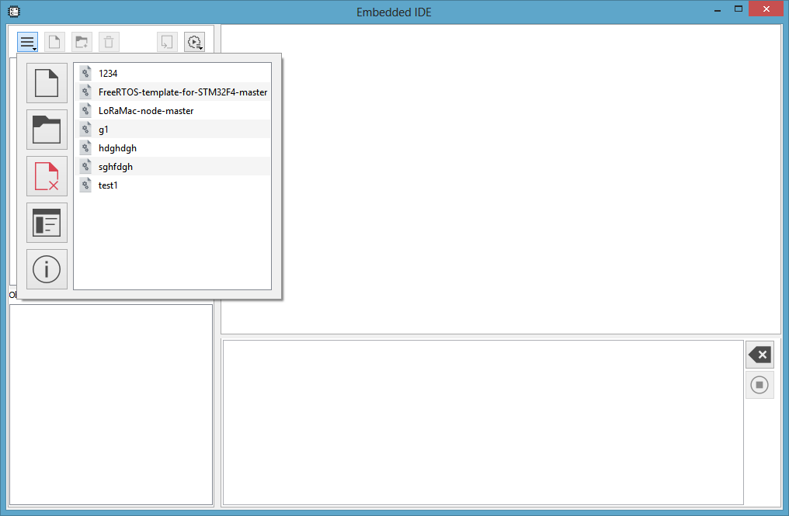
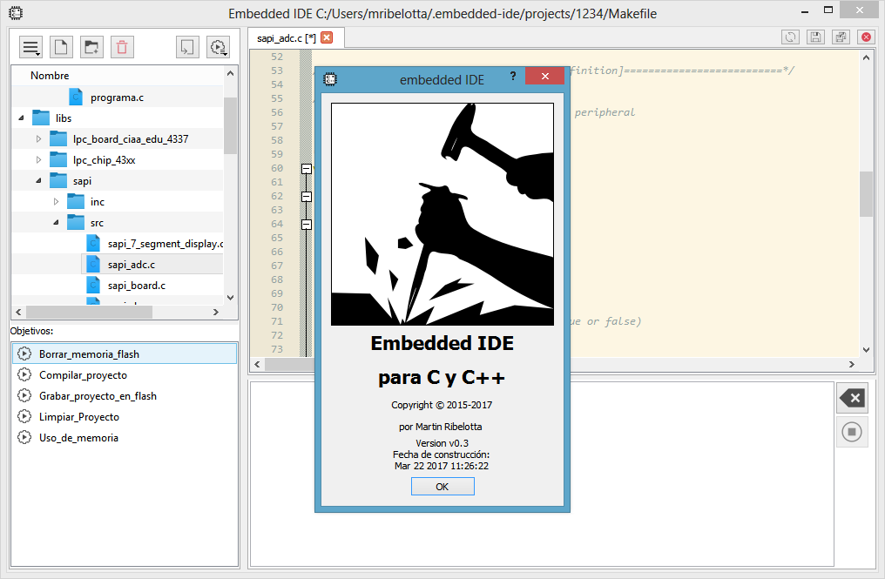

# Embedded IDE

Makefile based, C/C++ IDE


## Features
  - Syntax higlither (C/C++/Makefile)
  - Autocomplete (require clang installend on path)
  - Target autodiscover
  - Source filter
  - Project import/export
  - Console log

## Requeriments

  - GNU Make (required)
  - Qt5
  - clang (optional for autocompletion)
  - diff and patch (optional for import/export project)
  - ctags (optional for code indexing)

## Instalation

To compile and install IDE you need Qt5 (5.2 or late) and make/gcc (build-essential en Ubuntu and derived)

Into base directory do:
```bash
qmake && make
```

When the process is finis, the executable was found in `build` directory with the name `embedded-ide` (with EXE extention on windows)

To install it into the system copy `build/embedded-ide` to directory into the PATH

### Install dependencies

The full toolset instalation (for ubuntu and derivatives) is:

```bash
sudo apt-get install clang diffutils patch ctags make
```

Additionaly you need a compiler to work correctly. All gcc based compiler is supported like:

  - System gcc/g++ with `sudo apt-get install build-essential`
  - [ARM Embedded](https://launchpad.net/gcc-arm-embedded)
  - [RISC-V GNU toolchan](https://riscv.org/software-tools/)
  - [MIPS32/PIC32 gcc](https://github.com/chipKIT32/chipKIT-compiler-builds/releases)
  - All gcc based toolchain [from CodeSourcery](https://www.mentor.com/embedded-software/sourcery-tools/sourcery-codebench/editions/lite-edition/)
  - All [linaro toolchains](http://www.linaro.org/downloads/)
  - And much others...
  - [Cygwin toolchains](https://www.cygwin.com/)
  - [MinGW/MSYS enviroment](http://www.mingw.org/)

### Adding tools to the PATH

In order to find utilities, you need to add this to the PATH, but doing it globaly is dangerous in certains cases (Example, windows with multiple toolchains with similar names)

Because it, the IDE provide **Aditional PATHs** feature to configure the PATH only for IDE and not for entirye system.

Go to **Configure** icon and next go to **Tools** tab.


Into **Additional PATHs** section you can add multiple directories. The list is append to system PATH at runtime in top-to-bottom order.

## Images





